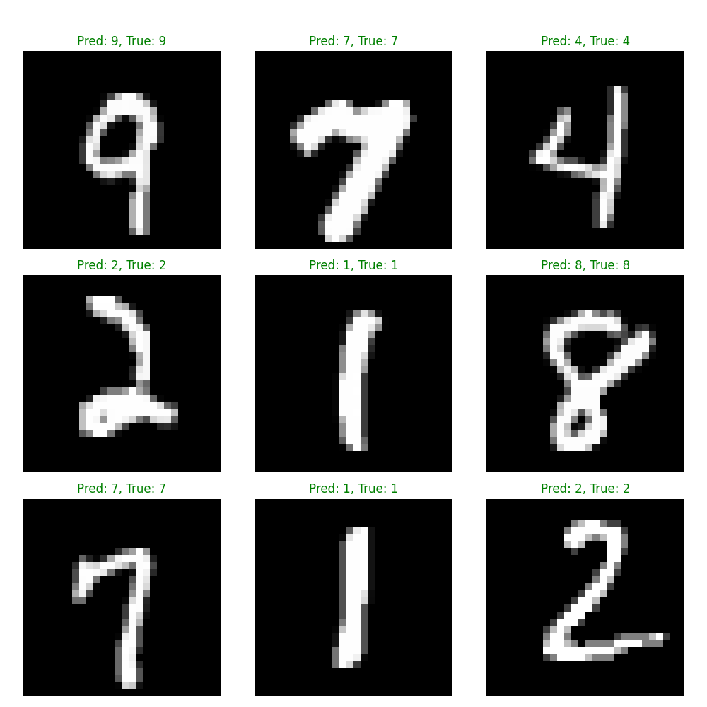

# MNIST Handwritten Digit Recognition using a Linear Classifier

This repository contains the source code for a simple handwritten digit recognition system using a linear classifier implemented in PyTorch. The system is trained and evaluated on the MNIST dataset.

## 1. Introduction

The MNIST dataset is a large database of handwritten digits that is commonly used for training and testing various image processing systems. This project aims to build a simple yet effective system for recognizing these handwritten digits. We employ a linear classifier, a fundamental building block in machine learning, to achieve this task.

## 2. The Model

The core of our system is a linear classifier model. This model takes a flattened 28x28 pixel image (784 features) as input and outputs a vector of 10 scores, one for each digit (0-9). The digit with the highest score is the model's prediction.

### 2.1. Mathematical Formulation

The linear classifier is defined by the following equation:

$$
y = Wx + b
$$

where:

-   $y$ is the output vector of scores (10x1).
-   $W$ is the weight matrix (10x784).
-   $x$ is the input vector of pixel intensities (784x1).
-   $b$ is the bias vector (10x1).

The model learns the optimal values for $W$ and $b$ during the training process.

### 2.2. Implementation

The model is implemented using the `torch.nn.Module` class in PyTorch. The `LinearClassifierModel` class defines the model architecture, which consists of a flattening layer followed by a single linear layer.

```python
class LinearClassifierModel(nn.Module):
    def __init__(self, input_feat, output_feat):
        super().__init__()
        self.flatten = nn.Flatten()
        self.linear_layer = nn.Linear(input_feat, output_feat)

    def forward(self, x):
        x_flattened = self.flatten(x)
        return self.linear_layer(x_flattened)
```

## 3. Training

The model is trained using the training set of the MNIST dataset. The training process involves iterating over the dataset multiple times (epochs) and updating the model's parameters to minimize the loss function.

### 3.1. Loss Function

We use the Cross-Entropy Loss function, which is commonly used for multi-class classification problems. The Cross-Entropy Loss is defined as:

$$
L = -\frac{1}{N} \sum_{i=1}^{N} \sum_{j=1}^{C} y_{ij} \log(\hat{y}_{ij})
$$

where:

-   $N$ is the number of samples.
-   $C$ is the number of classes (10 in our case).
-   $y_{ij}$ is 1 if sample $i$ belongs to class $j$ and 0 otherwise.
-   $\hat{y}_{ij}$ is the predicted probability of sample $i$ belonging to class $j$.

### 3.2. Optimization

We use the Stochastic Gradient Descent (SGD) optimizer to update the model's parameters. The SGD optimizer updates the parameters in the opposite direction of the gradient of the loss function.

### 3.3. The `train_model` function

The `train_model` function encapsulates the training loop. It iterates over the training data for a specified number of epochs, calculates the loss, and updates the model's parameters using the optimizer. It also evaluates the model on the test data at the end of each epoch.

```python
def train_model(model, epochs, optimizer):
    print(f'Starting training for {epochs} epochs...')
    model.to(device)
    for epoch in range(epochs):
        model.train()
        train_loss = 0.0

        for X, y in train_dataloader:
            X, y = X.to(device), y.to(device)

            y_pred_logits = model(X)

            loss = loss_fn(y_pred_logits, y)
            train_loss += loss.item()
            optimizer.zero_grad()
            loss.backward()
            optimizer.step()

        train_loss /= len(train_dataloader)

        model.eval()
        test_loss = 0.0
        with torch.inference_mode():
            for X_test_batch, y_test_batch in test_dataloader:
                X_test_batch, y_test_batch = X_test_batch.to(device), y_test_batch.to(device)

                y_test_logits = model(X_test_batch)

                loss += loss_fn(y_test_logits, y_test_batch).item()

            test_loss /= len(test_dataloader)

        if epoch % 5 == 0 or epoch == epochs - 1:
            print(f"Epoch {epoch}: Train loss: {train_loss:.4f}, Test loss: {test_loss:.4f}")

    print("Training complete.")
    return model
```

## 4. Results

After training the model for 20 epochs, we can visualize the model's predictions on a random sample of 9 images from the test set. The `plot_predictions` function is used for this purpose.



The title of each subplot shows the predicted label and the true label. The color of the title is green if the prediction is correct and red otherwise.

## 5. How to Run

To run the code, you need to have Python and PyTorch installed. You can install the required packages using the following command:

```bash
pip install -r requirements.txt
```

Then, you can run the `main.py` file:

```bash
python main.py
```

This will train the model and save the prediction plot to `mnist_predictions.png`.
